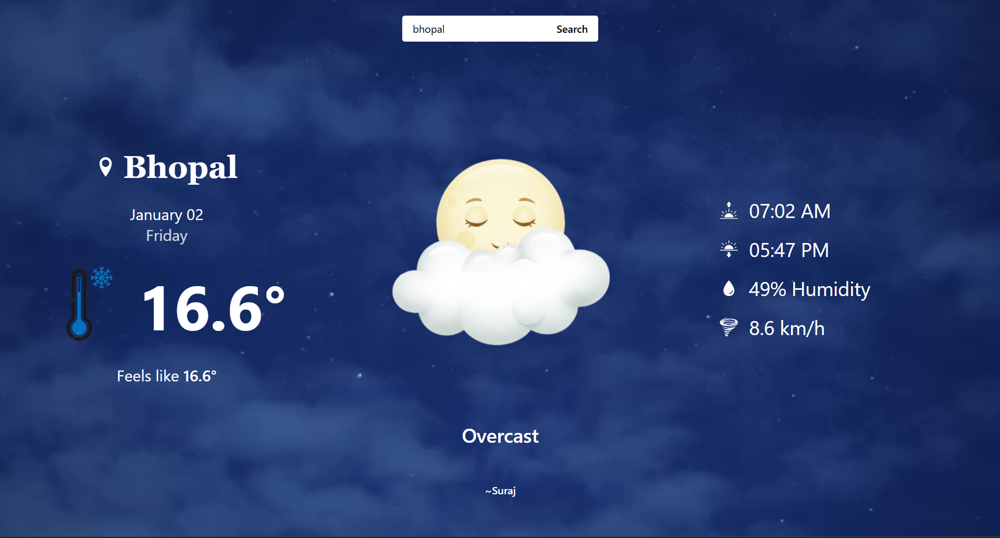

# 🌤️ React Weather App

A modern and responsive **Weather Application** built using **React.js** and **WeatherAPI**.  
It shows real-time weather information with dynamic UI based on **day/night** and **cloud conditions**.

---

## 🔥 Features

- 🔍 Search weather by city
- 🌞 Day / 🌙 Night UI (auto detects)
- ☁️ Cloud-based weather visuals
- 🌡️ Temperature & feels-like temperature
- 💧 Humidity & 🌬️ Wind speed
- 🌅 Sunrise & 🌇 Sunset time
- 🖼️ Dynamic background images
- ⚡ Fast loading with Skeleton Loader
- 💾 Last searched city saved in LocalStorage

---

## 🛠️ Tech Stack

- **React.js**
- **Vite**
- **Tailwind CSS**
- **Axios**
- **WeatherAPI**
- **React Icons**

---

## 📂 Project Structure
src/
│
├── assets/
│ ├── Sun.png
│ ├── Moon.png
│ ├── Cloudsun.png
│ ├── Cloudmoon.png
│ ├── Cleansky.avif
│ ├── Nightsky.avif
│ └── Nightcloud.avif
│
├── components/
│ ├── Wather.jsx
│ └── WeatherSkeleton.jsx
│
├── App.jsx
└── main.jsx


---

## 🚀 Installation & Setup

1️⃣ Clone the repository
```bash
git clone https://github.com/imsurajyd/weather-app.git

2️⃣ Go to project directory
cd weather-app

3️⃣ Install dependencie
npm install

4️⃣ Start development server
npm run dev

---

## 🔑 API Used
WeatherAPI
https://www.weatherapi.com/
Make sure you use your own API key.

---

## 📸 Preview
Dynamic UI changes based on:
Day / Night
Clear / Cloudy weather

---

## 🙌 Author
Suraj Kumar
💻 Frontend Developer | React Learner
🔗 GitHub: https://github.com/imsurajyd

---

## ⭐ Support
If you like this project, please ⭐ star the repository
and feel free to contribute or suggest improvements!